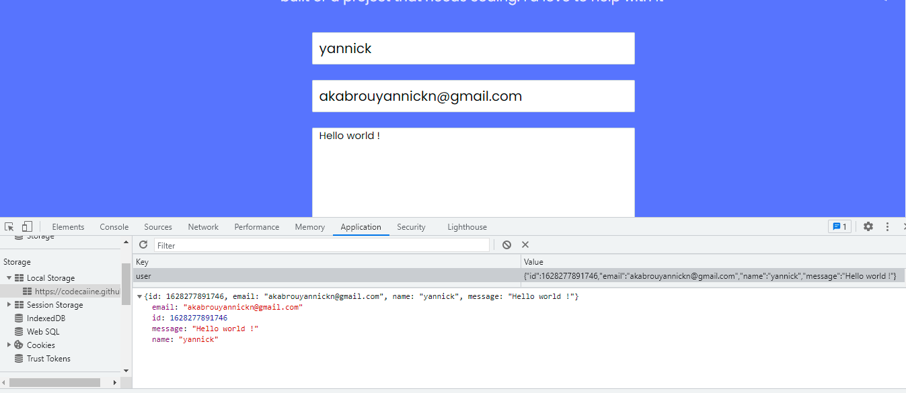

# Portfolio portfolio

The project is inspired by the figma microverse template 1 (https://figma.com/)
For this portfolio website, we save the form data in the local storage of the browser. That way when the user reloads the page the data they filled out in the form will be preserved.

 

## Live Demo

[Live Demo Link](https://codecaiine.github.io/microverse-javascript)
 
## Built With

- HTML
- CSS
- Javascript
- Bootstrap 
- HTML&CSS Linter
- Git

## Get Started

Please get your browser update.
To get a local copy up and running follow these simple steps.

Run the command below from the Terminal:

      git clone <URL> in your terminal

	  cd microverse_portfolio

	  start index.html

## Authors

👤 **Yannick-Noel AKA**

- Location: Côte d'Ivoire
- GitHub: [@codecaiine](https://github.com/codecaiine)
- Twitter: [@yannicknaka](https://twitter.com/yannicknaka)
- LinkedIn: [LinkedIn](https://www.linkedin.com/in/yannick-no%C3%ABl-aka/)

## 🤝 Contributing

Contributions, issues, and feature requests are welcome!

Feel free to check the [issues page](https://github.com/codecaiine/microverse-javascript/issues).

## Show your support

Give a ⭐️ if you like this project!

## Acknowledgments

- Thanks to Microverse
- Paka OLIPLICHE
- Ellis Mwanawabangona

## 📝 License

This project is [MIT](./MIT.md) licensed.
